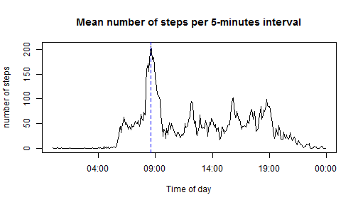

# Reproducible Research Project 1

## Initial code


```r
# set globally the option 'echo = TRUE'
library(knitr)
# avoid scientific notation
options(digits =2, scipen = 6)
opts_chunk$set(echo=TRUE, fig.height=4, fig.width=7, fig.align="center")
```


```r
# --------------------------------------------------------------------------------------------
# libraries & settings

library(lubridate)
```

```
## Warning: package 'lubridate' was built under R version 3.2.3
```

```r
library(dplyr)
```

```
## Warning: package 'dplyr' was built under R version 3.2.2
```

```
## 
## Attaching package: 'dplyr'
## 
## The following objects are masked from 'package:lubridate':
## 
##     intersect, setdiff, union
## 
## The following objects are masked from 'package:stats':
## 
##     filter, lag
## 
## The following objects are masked from 'package:base':
## 
##     intersect, setdiff, setequal, union
```

```r
library(ggplot2)
```

```
## Warning: package 'ggplot2' was built under R version 3.2.3
```

```r
# Changing temporarily the "LC_TIME" locale to match the english date/time conventions
# save
curloctime <- Sys.getlocale("LC_TIME")
# set
Sys.setlocale("LC_TIME", "English")
```

```
## [1] "English_United States.1252"
```


## Loading and preprocessing the data  
Requirement: The R working directory must contain the data zipfile, as well as the present R markdown document.

The data is read directly from the zip file (dataframe = `df`) and prepared:  
* The date strings are parsed and coerced to a date using the `lubridate` package  
* The interval code is the time of the beginning of the 5-minutes interval, expressed as a sting. A new column 'intervaltime' is added, which converts this code to a  POSIXct (date-time)  (useful for plotting). Only the 'hour:minute' part of this date-time will be used.  


```r
# ---------------------------------------------------------
# Loading and preprocessing the data

# file names
datazip <- "activity.zip"
datafname <- "activity.csv"
# open connection to zip,and read dataframe 'df'
zipcon <- unz(datazip, datafname)
df <- read.table(zipcon,
                 header=T, na.strings = "NA", quote="\"", stringsAsFactors = FALSE,
                 colClasses= c("numeric", "character", "character"),
                 sep=",", nrows=18000 )

# close connection, ignoring strange error
try(close(zipcon), silent = TRUE)


# preprocess the data:

# a) coerce date strings to dates
df$date<- ymd(df$date)

# b) code properly the intervals in a new column: construct time code "hh:mm"
newcharcode <- function(x) {
        n <- nchar(x)
        (if (n >= 4) {
                paste0(substr(x, start = 1, stop=2),
                       ":", substr(x, start = 3, stop=4))
        } else if (n == 3) {
                paste0("0", substr(x, start = 1, stop=1),
                       ":", substr(x, start = 2, stop=3))
        } else if (n == 2) {
                paste0("00:", x)
        } else if (n == 1) {
                paste0("00:0", x)
        } else {
                NaN
        })
}

makedate <- function(v){
        v <- sapply(v, newcharcode, USE.NAMES=FALSE)
        as.POSIXct(v, format = "%H:%M", tz = "",
                   origin = as.character(today()))
}

# create new intervaltime column
df$intervaltime <- makedate(df$interval)
```


## What is mean total number of steps taken per day?
Here the missing values are ignored, i.e. eliminated usind `complete.cases()` (as the only missing values are located in the `steps` column. It would not make sense to keep these rows, as the NA's might cout as zeroes in a sum, impacting the results. .


```r
nonatsteps <- df[complete.cases(df),] %>%
        group_by(date) %>%
        summarize(steps = sum(steps))

hist(nonatsteps$steps, col="green",
     main="steps per day", xlab = "steps", ylab = "Frequency (days)")
```


```r
# mean and median
meanstep1 <- mean(nonatsteps$steps)
medstep1 <- median(nonatsteps$steps)
```

Considering all (non-missing) number of steps , the median number of steps in a day is 10765, and the mean 10766.19


## What is the average daily activity pattern?

Here we first plot the daily activity pattern. The dataframe created in the process is named `nonamsteps` and will be useful later, when inmutting values


```r
nonamsteps <- df[complete.cases(df), ] %>%
        group_by(intervaltime) %>%
        summarize(steps= mean(steps,na.rm = TRUE))

with(nonamsteps,
        plot(x = intervaltime, y=steps, type = "l",
             main = "Mean number of steps per 5-minutes interval",
             xlab = "Time of day", ylab = "number of steps")
)

# maximal nb of steps
#  max interval time
maxt <- with(nonamsteps,
             intervaltime[which(steps == max(steps))])

hm <- hour(maxt) ## 8
mm <- minute(maxt) ## 35

abline(v=maxt, col="blue", lw=1, lt=2)
```



```r
# find maximum
maxsteps <- with(nonamsteps,
     steps[which(intervaltime==maxt)[1]])  ##206.1698
```

The average walking activity spikes early in the day, to a maximum of 206.17 steps, between 8:35 and 8:40, as shown on the plot.


## Imputing missing values

### Some exploration of the missing values


```r
mv <- c(missingdate = sum(is.na(df$date)), 
        missinginterval = sum(is.na(df$interval)),
        missingsteps = sum(is.na(df$steps)))
```
Missing values occur only in  'steps', in 2304 rows


```r
# missing values/values per day
sum(is.na(df$steps))/length(unique(df$interval))
```

```
## [1] 8
```

```r
# days with Missing values 
ina <- which(is.na(df$steps))
md <- length(unique(df$date[ina]))
```
The values of 'steps' for 8 full days are missing. All of the other days are complete  

### Imputation
I chose to impute to each missing value the mean number of steps for that 5-minute interval. That value will be found in the dataframe `nonamsteps`, created above. the resulting dataset will be called `cdf`


```r
# function to get the mean steps value for an intervaltime
mstep <- function(x) {
        with(nonamsteps,
             steps[which(intervaltime == x)[1]])
}

# impute values
cdf <- df
nastep <- is.na(df$steps)
cdf[nastep, "steps"] <- sapply(cdf[nastep,"intervaltime"],
                               FUN = mstep
                              )
```


### Histogram, mean and median after imputation

```r
ctsteps <- cdf %>%
        group_by(date) %>%
        summarize(steps = sum(steps))

hist(ctsteps$steps, col="blue",
     main="steps per day (missing values estimated)",
     xlab = "steps", ylab = "Frequency (days)")
```


```r
meanstep2 <- mean(ctsteps$steps)
medstep2 <- median(ctsteps$steps)
```
After imputation , the median number of steps in a day is 10766.19, and the mean 10766.19. The impact of imputation is minimal.


## Are there differences in activity patterns between weekdays and weekends?

### add new variable

```r
cdf$daytype <- factor(sapply(
        weekdays(cdf$date),
        FUN = function(x) {
                if (x %in% c("Saturday", "Sunday")) {
                        "weekend day"
                } else {
                        "week day"
                }
        }
))
```

### plot


```r
cmsteps <- cdf %>%
        group_by(intervaltime, daytype) %>%
        summarize(steps = mean(steps))


xlims <- c(min(cmsteps$intervaltime),
           max(cmsteps$intervaltime) )

ggplot(cmsteps, aes(x=intervaltime, y = steps))+
        geom_line()+
        geom_smooth(se=FALSE, show.legend = TRUE)+
        coord_cartesian(xlim = xlims, expand=FALSE) +
        scale_x_datetime(date_labels ="%H:%M",
                         date_breaks = "2 hour")+
        facet_grid(daytype ~ .) +
        labs(title = "Mean number of steps during 5-minutes intervals - weekdays vs weekend",
             x = "Time of day", y=  "Steps")
```


During weekdays, the activity spikes sharply in the early morning and then subsides. During weekend days, the initial spike is less pronounced, and  activity continues later in the day.
